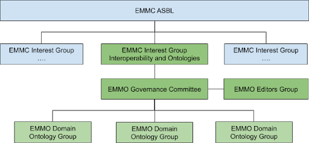
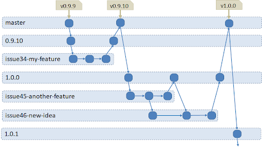
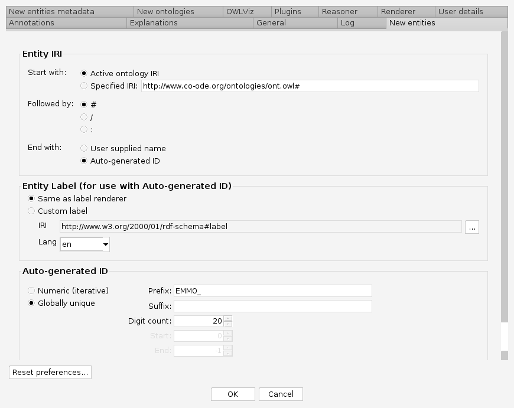

# EMMO Governance

## Content
* [EMMO basic structure](#emmo-basic-structure)
  - [Top level](#top-level)
  - [Middle level](#middle-level)
  - [Domain level](#domain-level)
  - [Application level](#application-level)
* [EMMO IP and licensing](#emmo-ip-and-licensing)
* [Governance remit](#governance-remit)
  - [Governance structure](#governance-structure)
  - [EMMO Governance Committee](#emmo-governance-committee)
  - [EMMO Editors Group](#emmo-editors-group)
  - [Domain ontologies governance](#domain-ontologies-governance)
  - [Organisation of repositories](#organisation-of-repositories)
    - [EMMO](#emmo)
    - [Domain Ontologies](#domain-ontologies)
    - [Tools](#tools)
    - [Examples](#examples)
  - [Releases and versioning](#releases-and-versioning)
  - [Documentation](#documentation)
  - [EMMO conventions](#emmo-conventions)
    - [Naming conventions](#naming-conventions)
    - [Namespace conventions](#namespace-conventions)
    - [Structural conventions](#structural-conventions)
* [Community contributions and interactions](#community-contributions-and-interactions)

## EMMO basic structure
EMMO is organised in different ontology levels:

### Top level
Top level EMMO contains only the most fundamental concepts.

### Middle level
Middle level EMMO contains cross-domain modules for Units, Properties, Mathematics, Models, Materials, Manufacturing and Semiotics (which includes observations). In addition it includes fundamental concepts for different perspectives, in particular Holistic, Reductionistic and Perceptual, as well as a Physicalistic perspective.

### Domain level
Domain ontologies reuse or specialise concepts from the middle and top level EMMO and specify terms and relationships that are relevant in a domain. A Domain is a particular area of interest, such as a branch of science and technology, e.g. organic chemistry, mechanics, electronics etc.

### Application level
In addition, there will be application ontologies, which are engineered for a specific use or application focus and whose scope is specified through testable use cases. Application ontologies re-use and extend terms from one or more domain ontologies to apply to a specific application, and generally cannot be reused for other applications.

__When the short-hand ‘EMMO’ is used, it generally stands for EMMO Top level and Middle level ontologies.__

## EMMO IP and licensing
EMMO (top level and middle level) is co-authored and (shown in brackets) copyrighted by
* Emanuele Ghedini (University of Bologna)
* Gerhard Goldbeck (Goldbeck Consulting)
* Jesper Friis (SINTEF)
* Adham Hashibon (Fraunhofer IWM)
* Georg J. Schmitz (ACCESS)

Updated Authors and Contributors will be published with every release.

EMMO is licensed under [Creative Commons Attribution 4.0 International Public License](https://github.com/emmo-repo/EMMO/blob/master/LICENSE.md).
It is a permissive licence which means that everybody can develop domain and application ontologies based on EMMO.

## Governance remit
EMMO Governance includes overseeing the maintenance and further development of EMMO top- and middle-level ontologies even when funding for the work is obtained from project grants and other sources.

It is also strongly encouraged that Domain ontology developments take place within the EMMO [Governance structure](#Governance-structure) (see in particular [Domain Ontology Groups](#Domain-ontologies-governance)).

*Application Ontologies are beyond the scope of EMMO overall governance and any issues arising are the responsibility of application development.*

### Governance structure
EMMO governance is organised via [EMMC ASBL](https://emmc.eu); i.e. committees and groups concerned with EMMO governance are constituted within the groups structure of EMMC. EMMO Governance Committee members and Group Leaders are either Individual Full Members of EMMC or belong to an organisational member of EMMC.

In particular, all EMMO related governance is part of the EMMC Interest Group on Interoperability and Ontologies. All contributors and users of EMMO, including domain and application ontologies are encouraged to join the EMMC Interoperability and Ontologies Interest Group.
Based on input by the EMMO Governance Committee and EMMO Domain Ontology Groups, the EMMC Interoperability and Ontologies Interest Group will be responsible for a high level roadmap which includes planned EMMO developments and objectives.

The governance structure is shown graphically in __Figure 1__.

_**Figure 1.** EMMO Governance Structure._

### EMMO Governance Committee
The EMMO Governance committee oversees and coordinates the maintenance and development of EMMO, in particular regarding top and middle level. The EMMO Governance Committee works at a conceptual level and makes high level decisions regarding for example (but not exclusively) key terminology, branches, releases, technical roadmap, general organisational matters of EMMO repository, external collaborations, publications, presentations, membership of EMMO Editors Group, high level decisions regarding domain ontologies, including coordinating cross-domain discussions, like resolution of inconsistencies between domain ontologies.

Membership of EMMO Governance committee consists of the authors of EMMO (the membership is updated only after a major release) who may co-opt other experts to the committee.

The EMMO Governance Committee meets in regular intervals, at least once every quarter. EMMO Governance Committee decision-making will be based on consensus finding. Failing that, a majority decision will be taken where all members need to participate in the vote for it to be valid.

### EMMO Editors Group
The EMMO Editors Group is responsible for the day-to-day management, technical management, maintenance and development of EMMO (top and middle level as well as domain alignments). EMMO editors are experienced in owl, Protégé, reasoners etc.
Only members of the Editors Group are allowed to accept pull requests and make changes in the ontology.
Members of the EMMO Editors Group are designated staff of the EMMO author organisations with relevant skills and other co-opted experts.
Members of the EMMO Editors Group will be listed in the Readme file of each release.
The EMMO Editors Group must refer to the EMMO Governance Committee for key decisions and provide regular reports and updates to the EMMO Governance Committee.

### Domain ontologies governance
Domain ontology development within the EMMO governance structure is strongly encouraged to ensure compatibility, compliance and wide stakeholder involvement.

For Domain Ontology development within the framework of EMMO governance and using the official EMMO repository, a proposal for a Domain Ontology development needs to be submitted to and approved by the EMMO Governance Committee.  Subsequently, an EMMO Domain Ontology Task Group is formed and Domain Ontology Editor roles are agreed. The Domain Ontology Task Group is responsible for the development and maintenance of the respective Domain Ontology in line with EMMO guidelines and is required to liaise with the EMMO Governance Committee and EMMO Editors Group who oversee the alignment with EMMO middle and top level, and provide general support regarding development, integration and interoperability in line with EMMO guidelines.

Following quality control procedures (to be defined separately) a Domain Ontology release may be given an official EMMO Domain Ontology status by the EMMO Governance Committee.

### Organisation of repositories
The GitHub organisation https://github.com/EMMO-repo/ is the "official" site for development and distribution of EMMO and related domain ontologies and tools. Each of these will have its own git repository within the [EMMO-repo](https://github.com/EMMO-repo/) organisation. The repositories are organised as follows.

#### EMMO
* Organised with EMMO top and middle level ontologies in two separate subfolders. All top level ontologies are also included in the top.owl file which can be addressed using URL http://emmo.info/emmo/top.
* The root folder includes an emmo.owl file containing all EMMO top and middle level ontologies. It can be addressed under the URL http://emmo.info/emmo.

#### Domain Ontologies
* EMMO Domain Ontologies will be managed within separate repositories. These ontologies will follow the conventions outlined for EMMO and never duplicate any class or relation defined in EMMO top and middle level. Consistency and dependencies between these ontologies shall be managed via Domain Group meetings, liaising with EMMO Editor Group and decision making by EMMO Governance Committee where required.
* It is recommended that domain ontologies are organised hierarchically, such that more specialised domain ontologies will import generic domain-level concepts from less specialised domain ontologies.  However, as stated above, detailed management of domain ontologies is beyond the remit of EMMO governance. Rather, general [best practice](http://wiki.opensemanticframework.org/index.php/Ontology_Best_Practices) should be applied.

#### Tools
* EMMO-repo includes separate repositories for tools that are useful for working with EMMO and EMMO-based ontologies. [EMMO-python](https://github.com/emmo-repo/EMMO-python) is an example of such a tool. Additional tools from different communities may be brought into the EMMO-repo if said parties wish for it, EMMO Editors recommend it and EMMO Governance Committee agrees.

#### Examples
* EMMO-repo includes a separate repository with application examples. Application examples are managed by a range of contributors and are not generally ‘certified’ by EMMO Editors unless specifically stated.

### Releases and versioning
All releases of EMMO will be versioned strictly according to the rules of semantic versioning as described on https://semver.org/. Each version will be addressable via URL as follows

* EMMO (top and middle) release master\
   http://emmo.info/emmo
→  https://raw.githubusercontent.com/emmo-repo/EMMO/master/emmo.owl
* EMMO (top and middle) version X.Y.Z\
http://emmo.info/emmo/X.Y.Z
→ https://raw.githubusercontent.com/emmo-repo/EMMO/X.Y.Z/emmo.owl
* EMMO top release master\
http://emmo.info/emmo/top/
→  https://raw.githubusercontent.com/emmo-repo/EMMO/master/top/
* EMMO top version X.Y.Z\
http://emmo.info/emmo/X.Y.Z/top/
→  https://raw.githubusercontent.com/emmo-repo/EMMO/X.Y.Z/top/
* EMMO middle release master\
http://emmo.info/emmo/middle/
→  https://raw.githubusercontent.com/emmo-repo/EMMO/master/middle/
* EMMO middle version X.Y.Z\
http://emmo.info/emmo/X.Y.Z/middle/
→  https://raw.githubusercontent.com/emmo-repo/EMMO/X.Y.Z/middle/
* EMMO “my_domain” release master\
http://emmo.info/my_domain_1/
→  https://raw.githubusercontent.com/emmo-repo/MY_DOMAIN_1/master/
* EMMO “my_domain” version X.Y.Z\
http://emmo.info/my_domain_1/X.Y.Z/
→ https://raw.githubusercontent.com/emmo-repo/MY_DOMAIN_1/X.Y.Z/

The branching model applied for EMMO (and strongly suggested for domain ontologies and tools) is illustrated in Figure 2 following a set of rules:
* Never pull to master. Master is only changed via pull requests from a release branch reviewed by the EMMO Editors Group. The master branch always hosts the current stable version.
* Each change of the master branch corresponds to a new release, with a unique semantic version number. All versions should be tagged with the version number prefixed with a “v”. For example, the tag for version 1.0.0 should be “v1.0.0”.
* Work on the next release is done in a separate release branch named after the targeted version. For example, all work towards version 0.9.10 is done in a branch with name “0.9.10”.
* After a release branch has been merged into master, it is kept, but never changed. The IRI of past versions of the EMMO will be redirected to the corresponding branches.
* All features should be associated with an issue.
* Features are developed in separate branches derived from a version branch and merged back via reviewed pull requests. Feature branches should be named “issue<N>-<SHORT-MESSAGE>”, where <N> is the issue number and <SHORT-MESSAGE> is a short message describing the feature.
* Before issuing, the developer should ensure that all unit and other tests pass. At least one EMMO Editor Group member must be assigned.

_**Figure 2.** EMMO branching model. The light blue horizontal boxes correspond to branches,  blue boxes to commits (i.e. snapshots of the repository) and brown boxes to tags._

Only ontologies or tools with version number equal to or larger than 1.0.0 are expected to satisfy all requirements.

An inferred version of the ontology will be published with each release under the URL http://emmo.info/emmo/emmo-inferred
and
http://emmo.info/emmo/X.Y.Z/emmo-inferred.

### Documentation
The GitHub release feature and GitHub Pages https://emmo-repo.github.io/ will be used for generated documentation.

### EMMO conventions
EMMO follows a set of conventions that all ontologies published in a repository under https://github.com/emmo-repo/ are expected to follow.

#### Naming conventions
* Use SKOS:prefLabel for human readable names.  Within one ontology (or namespace), all SKOS:prefLabel's should be unique.  Each entity should have one and only one SKOS:prefLabel.
* Use SKOS:altLabel for alternative labels.  It is good practice to also keep SKOS:altLabel's unique within a namespace.
* Class labels should be singular nouns and _CamelCase_.
* Property labels should be _lowerCamelCase_. Object and data properties should (normally) start with “has” followed by a noun.  EMMO top and middle does not explicitely define inverse relations (but uses `inverse(has<Something>)` instead). 
* Instance labels should be _lowercase_with_underscores_.

#### Namespace conventions
* All OWL identifiers are globally unique IRIs.
* Since EMMO version 1.0.0-beta, the recommended naming of OWL identifiers is

      http://emmo.info/<domain>#EMMO_<UUID>

  where <domain> is the name of the domain ontology (or "emmo" for EMMO top and middle) and <UUID> is a unique universally identifier (UUID) for the entity, usually assigned by Protègè or a similar tool. See Figure 3 for an example for how to configure Protègè to generate correct IRIs for new entities.

#### Structural conventions
* New relations (i.e. object properties) must be either mereotopological or semiotical and be a subrelation of any of the relations defined in EMMO Core.

_**Figure 3.** The dialog in Protègè for configuring new IRIs. It is found under File->Preferences menu and then the “New Entities” tab. These settings should be used consistently in all EMMO ontologies._

## Community contributions and interactions
Domain and application ontology developers and the wider community is encouraged to contribute to EMMO development.

A FAQ area will be developed to address queries that may already have been answered.

GitHub features will be used for most of the interactions, in particular issues can be raised by creating an issue, hence requests can be managed by EMMO Editors.
